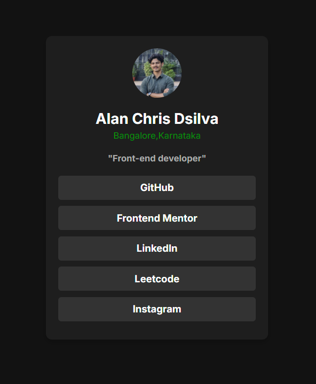
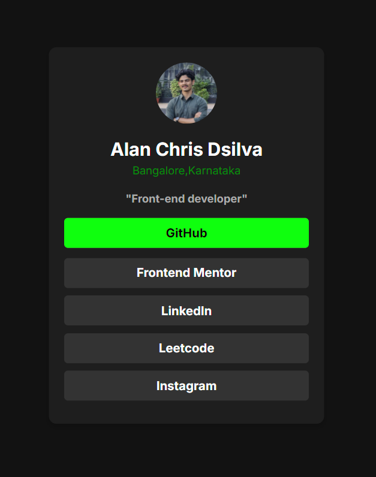

# Social Links Profile

This project is a solution to the [Frontend Mentor Social Links Profile Challenge](https://www.frontendmentor.io/challenges/social-links-profile-UG32l9m6dQ). The challenge involves creating a visually appealing and responsive profile card with social media links, allowing users to hover over or focus on interactive elements.

## Table of Contents

- [Overview](#overview)
  - [Features](#features)
  - [Screenshots](#screenshots)
  - [Links](#links)
- [Built With](#built-with)
- [What I Learned](#what-i-learned)
- [How to Use](#how-to-use)
- [Author](#author)
- [Acknowledgments](#acknowledgments)

---

## Overview

### Features

- 🌟 **Interactive Buttons:** Hover and focus states for all links.
- 📱 **Responsive Design:** Looks great on mobile, tablet, and desktop screens.
- 🎨 **Customizable:** Easy to adapt colors, fonts, and links.

---

### Screenshots

#### Default View:


#### Hover View:


---

### Links

- 🔗 **Solution URL:** [GitHub Repository](#)
- 🌐 **Live Site URL:** [Live Demo](#)

---

## Built With

- 📝 **HTML5** for semantic structure
- 🎨 **CSS3** for styling
  - Flexbox
  - Custom properties
  - Hover effects
- 🛠️ **JavaScript** (if applicable)
- 📐 **Responsive Design Principles**

---

## What I Learned

During the development of this project, I gained deeper insights into:

- ✨ Styling buttons for hover/focus states using CSS.
- 🔧 Structuring a profile card layout with Flexbox.
- ♿ Enhancing accessibility for interactive elements.

Here's an example of a hover effect implemented for the buttons:

```css
button:hover {
  background-color: #00ff00; /* Neon green for hover state */
  color: #000; /* Black text color for contrast */
  transition: 0.3s ease-in-out; /* Smooth transition */
}

## Author

```plaintext
👤 Name: Alan Chris Dsilva  
📍 Location: Bangalore, Karnataka  
🔗 Frontend Mentor Profile: Alan Chris Dsilva  
🐙 GitHub: AlanChrisDsilva  

